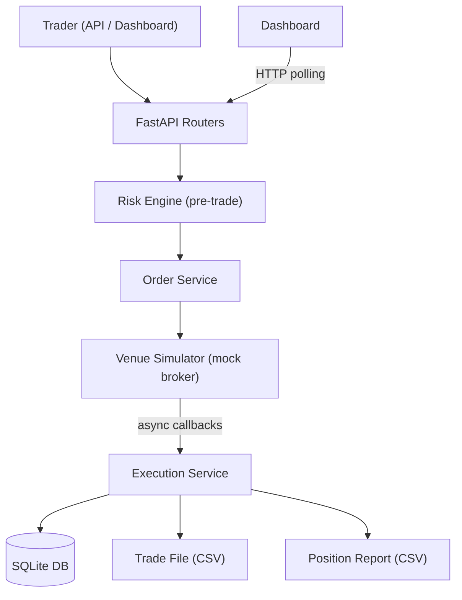
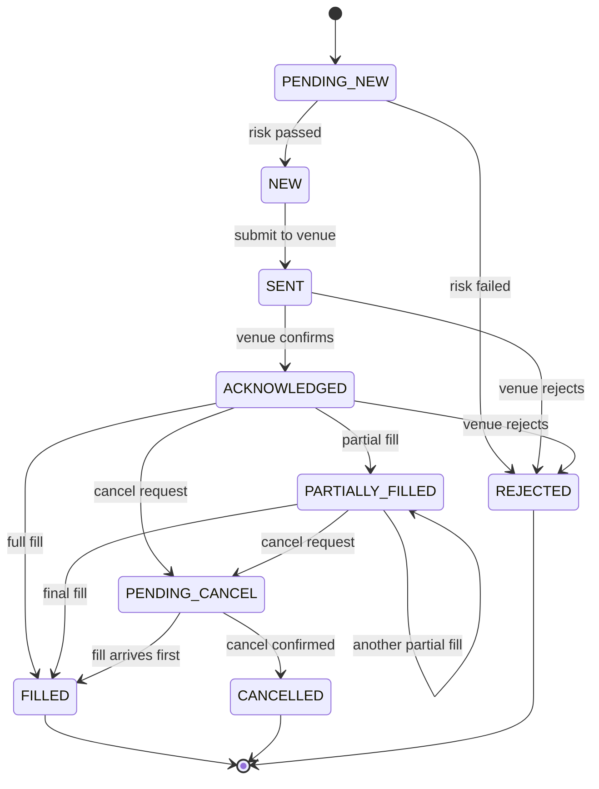

# GHFM Order Management System

OMS prototype for a global macro hedge fund. Covers the full trade order lifecycle: creation, validation, risk checks, venue execution, fill processing, position tracking, and post-trade reporting. Supports equities, FX, commodities, and fixed income.

## Executive summary

The basic question this system answers: an order comes in, it gets validated, sent to a broker, filled (maybe partially), and the resulting position needs to be tracked and reported to multiple parties. How do you structure that cleanly?

I built it around three ideas:

1. The order lifecycle is a state machine. Orders move through defined states (PENDING_NEW, NEW, SENT, ACKNOWLEDGED, PARTIALLY_FILLED, FILLED) with a transition table that rejects anything invalid. The states map to FIX protocol OrdStatus values (tag 39), because any production OMS talks to brokers via FIX. The state machine also handles edge cases that matter in practice: partial fills (large orders filled in multiple tranches) and the cancel-fill race condition (a fill arriving after a cancel request was sent but before the venue processed it).

2. Risk checks run before anything hits the venue. Six checks: restricted instruments (China domestic equities, per GHFM's investment policy), order size limits per asset class, notional caps, position concentration limits, trader permissions by asset class, and a limit price sanity check for fat-finger protection. All six run even if earlier ones fail, so the trader sees everything wrong at once.

3. The OMS feeds downstream systems. It generates prime broker trade files (CSV with correct settlement dates: T+1 for equities, T+0 for FX, T+2 for fixed income), fund admin position reports (with P&L breakdown for NAV calculation), and a three-way reconciliation comparing internal positions against prime broker and fund admin records. These are the actual data flows that keep a hedge fund's books aligned.

The instruments in the system (AAPL, USDJPY, GCQ26, TY1, etc.) were picked to match what a macro fund actually trades. Every state change gets logged to an append-only audit table, which is both a regulatory requirement (MAS, CIMA) and useful for debugging.

Tech stack: Python 3.12, FastAPI, SQLAlchemy 2.0 + SQLite, Pydantic v2. The database, venue connector, and message transport can each be swapped independently without touching domain logic.

## Quick start

```bash
# Requires Python 3.11+
pip install -e .

# Start the server
uvicorn oms.main:app --reload

# Run the automated demo (in another terminal)
python demo.py

# Or open:
#   Dashboard:  http://localhost:8000/
#   API docs:   http://localhost:8000/docs
```

## Architecture



The architecture is event-driven. The venue simulator produces FIX-style execution reports via async callbacks, and the execution service processes them separately from the order submission flow. This mirrors how production OMS platforms work: order submission is outbound and fast, but fills are inbound and can arrive over seconds or minutes as partial fills. Keeping these paths separate means the API never blocks waiting for a venue response.

## Design choices

### FastAPI

FastAPI is async-native, which matters here because order submissions, venue responses, and position updates happen concurrently. Flask processes one request per worker; FastAPI handles concurrent streams without blocking. Pydantic is built in, so every order request gets validated at the API boundary before it touches business logic. The auto-generated docs at `/docs` also double as a testing interface for the prototype review.

### SQLite (and why it swaps easily)

The whole database is one file, so anyone reviewing this can run it without installing PostgreSQL. The ORM uses SQLAlchemy 2.0 with async support. Migrating to PostgreSQL only requires changing the connection string.

Monetary values use `DECIMAL(18, 8)` instead of floating point. IEEE 754 floats can't exactly represent 0.1, and rounding errors compound across thousands of trades. The 8 decimal places handle both fractional shares and FX rates at pip-level precision.

### State machine

The order lifecycle is modeled as an explicit transition table (`oms/state_machine.py`) rather than status updates scattered across business logic.

The table defines every valid (from_state, to_state) pair. Trying to cancel a filled order gets rejected at the domain level. In production, race conditions between fills and cancellations happen regularly and the state machine has to handle them correctly.

Every transition goes through one function that creates an event in the `order_events` table. This keeps the audit trail complete by construction. MAS and CIMA both require full audit trails of order state changes.

The states themselves map to FIX OrdStatus (tag 39). PENDING_NEW and ACKNOWLEDGED exist because FIX distinguishes between submitting a NewOrderSingle (35=D) and receiving back an ExecutionReport (35=8, ExecType=New) confirming the venue accepted the order. Most OMS prototypes skip ACKNOWLEDGED; including it here reflects how the protocol handshake actually works.

### Append-only audit trail

The `order_events` table is write-only by design. Instead of overwriting order status, every change gets a new row with a timestamp and JSON details. You can reconstruct any order's exact state at any point in time by replaying events up to that timestamp. That's needed for regulatory inquiries and trade disputes. In production this would sit on something like Kafka with long retention or EventStoreDB.

### FIX-inspired execution reports

The venue simulator outputs messages using FIX field names: ExecType (tag 150), OrdStatus (tag 39), LastQty (tag 32), LastPx (tag 31), CumQty (tag 14), AvgPx (tag 6), LeavesQty (tag 151). FIX is the standard protocol for electronic trading, used by most brokers and exchanges. Structuring the simulator this way means the execution service's callback handler (`process_execution_report`) already parses the same fields a real FIX adapter would produce. Swapping the simulator for QuickFIX/Python changes the transport (TCP sockets vs in-process callbacks) but not the processing logic.

## Order workflow



### State transitions worth noting

PENDING_NEW exists because in production, risk checks might call external services (margin calculation, blacklist lookups). It represents the gap between the trader hitting submit and the risk engine clearing the order. Here the checks are synchronous, but the state is there.

SENT to ACKNOWLEDGED maps to the FIX handshake: you send a NewOrderSingle, and the venue sends back an ExecutionReport with ExecType=New before any fills happen.

PARTIALLY_FILLED can transition to itself. Large orders get filled in multiple tranches. Each partial fill updates the cumulative quantity and volume-weighted average price.

PENDING_CANCEL to FILLED is the race condition case. The trader requests cancellation, but a fill arrives from the venue first. The OMS has to accept it because the trade already happened at the exchange. The demo script shows this.

### Workflow steps

1. Trader submits an order via API or dashboard.

2. Pydantic validates field types and constraints. LIMIT orders require a limit price.

3. Pre-trade risk checks run before the order is accepted:
   - Restricted symbols: China A-shares are blocked (600519.SS, 000858.SZ, CSI300). This matches GHFM's policy of avoiding China domestic equity.
   - Order size limits: calibrated per asset class. 100K shares is reasonable for equities; FX trades are in millions of base currency.
   - Notional cap: $10M per order. For a fund managing $6.3B, individual orders are a small fraction of AUM. This catches outsized submissions.
   - Position limits: max net exposure per symbol to prevent concentration.
   - Trader permissions: an equity trader can't submit FX orders without authorization.
   - Limit price sanity: rejects LIMIT orders more than 10% from reference price. Fat-finger protection.

   All checks run even if some fail, so the trader sees every problem at once.

4. Order transitions through NEW, SENT, and gets submitted to the venue simulator async.

5. The simulator acknowledges (ExecType=New), then produces fills. Each fill creates a record, updates the order's cumulative filled quantity and VWAP, and updates the position.

6. Position management calculates weighted average cost when adding to a position, realized P&L when reducing or closing (using `(fill_price - avg_cost) * closed_qty`), and unrealized P&L from current reference prices. Position flipping (long to short in one trade) is handled: P&L is realized on the closed portion, new average cost is set for the remainder.

7. Every state change is logged to `order_events` with timestamp, from/to status, and event details in JSON.

## Trade files and position reports

### Why these reports exist

The OMS isn't the only system tracking positions. The prime broker keeps its own books based on trades it cleared. The fund administrator keeps independent books for NAV calculation and investor reporting. These three sets of records need to match. The reports here mirror those real data flows.

### Prime broker trade file

Generated via `GET /reports/trades`. CSV with these columns:

| Column | Description |
|--------|-------------|
| TradeDate | Execution date |
| SettlementDate | T+1 for equities, T+0 for FX, T+2 for fixed income |
| ClientOrderID | OMS-assigned order identifier |
| ExecID | Venue-assigned execution identifier |
| Symbol, Side, Quantity, Price | Trade details |
| Notional | Quantity x Price |
| Commission | Per-fill transaction costs |
| Venue, Strategy, Trader | Routing and attribution |

Settlement dates follow market conventions rather than a fixed offset. Getting them wrong causes failed settlements, which means penalties and operational headaches. In production this would also account for weekends, holidays, and market-specific calendars.

### Fund admin position report

Generated via `GET /reports/positions`. The fund admin uses this to independently compute NAV. Investors subscribe and redeem based on the admin's NAV, not the OMS figure, so the data needs to be complete and accurate. GHFM's NAV is struck monthly and audited annually by EY.

| Column | Description |
|--------|-------------|
| Symbol, AssetClass, Quantity | Position details |
| AverageCost, CurrentPrice | Cost basis and mark-to-market |
| MarketValue | Quantity x CurrentPrice |
| UnrealizedPnL, RealizedPnL, TotalPnL | P&L breakdown |
| PercentOfNAV | Position weight |

### Three-way reconciliation

`GET /reports/reconciliation` compares OMS positions against prime broker and fund admin records. Breaks get flagged with details (e.g., "PB qty mismatch: OMS=5000, PB=4990"). Common causes in production: rounding differences, trade date vs settlement date misalignment, corporate actions processed at different times, FX rate timing differences.

In production this runs overnight so each day starts with clean, verified positions. The prototype simulates small random discrepancies to show the break detection working.

## Instrument selection

The reference prices aren't random. They reflect what a global macro fund actually trades:

- Equities: AAPL, MSFT, NVDA (US large-cap), TSM (Taiwan Semi, relevant for Asia macro), 9984.T (SoftBank, JPY-denominated, Japan macro)
- FX: USDJPY, EURUSD, GBPUSD, AUDUSD (G10 pairs), USDSGD (GHFM is Singapore-based)
- Commodities: GCQ26 (gold futures, inflation hedge), CLQ26 (WTI crude, energy exposure)
- Fixed income: TY1 (10Y US Treasury futures), JGB1 (Japanese government bond futures, rate divergence)

No China domestic instruments, consistent with the firm's investment policy.

## Scaling for production

### What changes

The database would move to PostgreSQL with date-based partitioning on orders and fills. Read replicas handle reporting queries so they don't compete with writes. PgBouncer for connection pooling, JSONB columns for event metadata.

In-process async callbacks would be replaced by Kafka or Redis Streams. The current callback pattern (VenueSimulator to ExecutionService) maps directly to a Kafka consumer on an `execution-reports` topic, which adds replay, multiple consumers, and guaranteed delivery.

The venue simulator would be replaced by QuickFIX/Python or a managed FIX gateway (Rapid Addition, Ullink) with multiple venue connections for best execution and drop copy sessions for independent reconciliation.

The risk engine would become a separate service with Redis-cached position lookups. Limits would be configurable per trader, desk, and strategy via a database and management UI rather than hardcoded. Market-data-aware checks (e.g., reject orders during circuit breakers) would also be added.

Auth would use OAuth 2.0 with role-based access and approval workflows for orders above threshold notionals. API keys for programmatic access from quant research systems.

For observability: OpenTelemetry tracing on every order through to settlement, Prometheus metrics (submission rate, fill latency p99, rejection rate by reason), and Grafana dashboards.

Deployment would use Kubernetes with separate pods for the API (latency-sensitive), execution processing (throughput-sensitive), and report generation (batch). Blue-green deploys for zero-downtime releases during market hours.

On the compliance side: MAS regulatory reporting, CIMA requirements for the Cayman-domiciled fund, trade surveillance, and audit trail retention (typically 5-7 years).

### What stays the same

The state machine, the separation between routers/services/models, and the event-driven execution processing pattern all hold at production scale. The audit trail design (append-only events) works the same whether backed by SQLite or Kafka. The risk check architecture (run all checks, aggregate failures) is also unchanged; the checks themselves get more sophisticated, but the pattern doesn't.

## Assumptions and limitations

- Single currency (USD). Production needs multi-currency with FX rate conversion for consolidated P&L.
- No authentication on API endpoints.
- Venue simulator runs in-process. Production uses external FIX connections with session management, sequence numbers, and reconnect logic.
- SQLite only supports one writer at a time. Fine here, not for concurrent production use.
- Reference prices are hardcoded. Production uses Bloomberg, Reuters, or exchange feeds.
- Only MARKET and LIMIT order types. Production would add stop-loss, stop-limit, iceberg, TWAP, VWAP, and implementation shortfall algos.
- Single account (GHFM-MACRO-001). Production would support block order allocation across multiple funds with pro-rata or target-weight rules.

## Tech decisions and trade-offs

| Decision | Why | Trade-off |
|----------|-----|-----------|
| SQLite over PostgreSQL | Zero setup, reviewer can run immediately | No concurrent writes, no JSONB, no replicas |
| Synchronous risk checks | Simpler flow, fast enough for prototype | Would need async for real-time market data lookups |
| In-process venue simulator | One process, nothing extra to configure | Can't simulate real network failures or session drops |
| Pydantic v2 | Type safety at API boundary, auto-docs, fast | Verbose for simple cases |
| UUID order IDs | No collisions across distributed systems | Harder to read than sequential integers |
| Async FastAPI + aiosqlite | Matches production patterns, venue callbacks work naturally | More complex than sync for a SQLite prototype |
| Hardcoded risk limits | Visible in source, no DB needed | Not configurable at runtime |
| Denormalized filled_quantity on orders | Avoids SUM(fills) on every read | Needs careful consistency with fills table |

## Project structure

```
ghfm-oms/
├── oms/
│   ├── main.py              # FastAPI app, lifespan, middleware
│   ├── config.py             # Settings (pydantic-settings)
│   ├── database.py           # SQLAlchemy async engine + session
│   ├── enums.py              # OrderStatus, OrderSide, OrderType, AssetClass
│   ├── models.py             # ORM tables: orders, fills, order_events, positions
│   ├── schemas.py            # Pydantic request/response models
│   ├── state_machine.py      # Transition table + validation
│   ├── risk_engine.py        # 6 pre-trade checks
│   ├── venue_simulator.py    # Mock broker, FIX-style execution reports
│   ├── services/
│   │   ├── order_service.py      # Order creation, cancellation, lifecycle
│   │   ├── execution_service.py  # Fill processing, position updates, P&L
│   │   └── report_service.py     # Trade files, position reports, reconciliation
│   └── routers/
│       ├── orders.py         # POST/GET /orders, POST /orders/{id}/cancel
│       ├── positions.py      # GET /positions
│       └── reports.py        # GET /reports/trades, /positions, /reconciliation
├── static/
│   └── index.html            # Trading dashboard (dark theme, polls every 2s)
├── tests/
│   ├── test_state_machine.py # Transitions, terminal states, race conditions
│   └── test_risk_engine.py   # Restricted symbols, permissions, notional, size
├── demo.py                   # End-to-end demo across 16 scenarios
└── pyproject.toml
```

## Tests

```bash
pip install -e ".[dev]"
pytest tests/ -v
```

15 tests covering the state machine and risk engine. The state machine tests check valid transitions, terminal state enforcement, partial fill self-transitions, and the cancel-fill race condition. The risk engine tests check restricted symbol rejection, unauthorized traders, excessive notional, order size limits, limit price sanity, and that clean orders pass everything.
